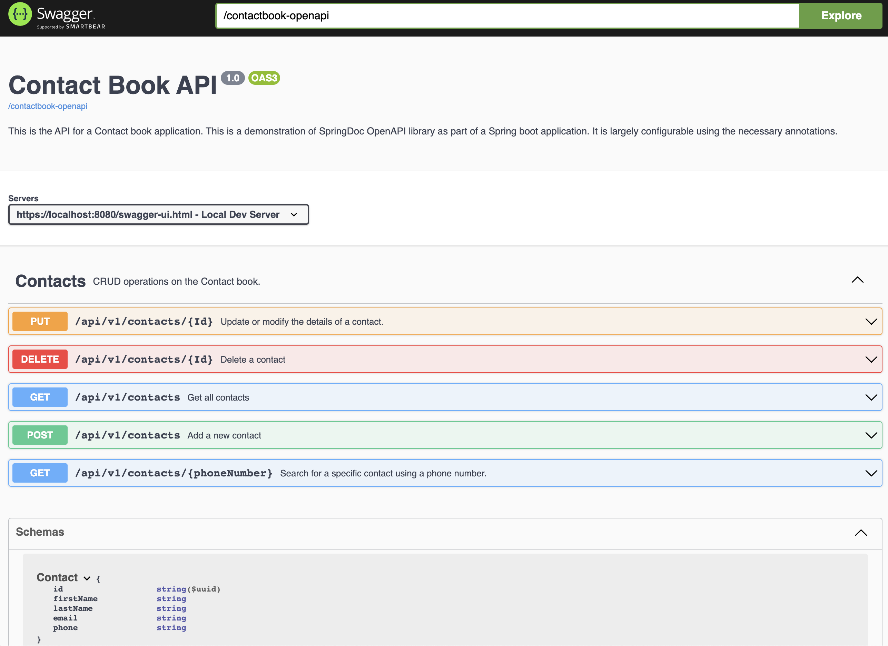

# Contact Book API
This is a Spring boot application with SpringDoc OpenAPI included.
This project takes into consideration, some of the best practices when it comes to designing REST APIs.

## Requirements / Dependencies
- Java 17
- Spring boot
- Lombok
- SpringDoc OpenApi
- Flyway DB migration
- PostGreSQL

## Setup
1. Clone repository into local folder.
2. Open project using IDE.
3. Install dependencies.
4. Create PostgreSql database and schema using Cli or app.
5. Configure application.properties file with database connection details.
6. Run Spring boot application and navigate to http://locahost:8080/swagger-ui.html

## App

## TODO
- Writing unit tests for all endpoints.
